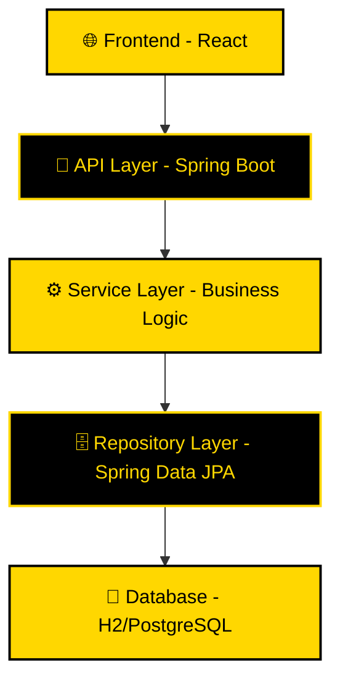

<div align="center">

# ⚡ **Modernized Todo Application** ⚡


### 🚀 **Uma aplicação Todo moderna migrada de COBOL para Java Spring Boot + React**

---

</div>

## 📋 **Visão Geral**

> **Transformação Digital Completa**: Este projeto representa a modernização de uma aplicação COBOL legada para uma arquitetura moderna full-stack, demonstrando as melhores práticas de migração e desenvolvimento.

<table>
<tr>
<td width="50%">

### 🔧 **Backend (Spring Boot)**
- ☕ **Java 17** - Linguagem robusta
- 🍃 **Spring Boot 3.x** - Framework moderno
- 🗄️ **Spring Data JPA** - Persistência
- 🔐 **Spring Security** - Segurança
- 🌐 **RESTful APIs** - Comunicação
- 💾 **H2 Database** - Desenvolvimento

</td>
<td width="50%">

### ⚛️ **Frontend (React)**
- ⚛️ **React 18** - Interface moderna
- 🎨 **Material-UI** - Componentes elegantes
- 🧭 **React Router** - Navegação
- 📡 **Axios** - Comunicação HTTP
- 📅 **Date-fns** - Manipulação de datas

</td>
</tr>
</table>

---

## ✨ **Funcionalidades Principais**

<div align="center">

| 👥 **Gerenciamento de Usuários** | 📝 **Gerenciamento de Tarefas** | 📊 **Dashboard** |
|:---:|:---:|:---:|
| ✅ Criar, listar, atualizar e deletar | ✅ CRUD completo de tarefas | ✅ Visão geral de usuários |
| ✅ Validação de dados completa | ✅ Atribuição de tarefas | ✅ Acesso rápido a tarefas |
| ✅ Validação de idade (18+) | ✅ Sistema de prioridades | ✅ Estatísticas em tempo real |
| ✅ Campos obrigatórios | ✅ Controle de status | ✅ Interface intuitiva |

</div>

---

## 🚀 **Início Rápido**

### 📋 **Pré-requisitos**

```bash
☕ Java 17+    📦 Node.js & npm    🔨 Maven
```

### 🔧 **Executando o Backend**

```bash
# 📁 Navegar para o diretório backend
cd modernized-todo-app/backend

# 🔨 Build do projeto
mvn clean install

# 🚀 Executar aplicação
mvn spring-boot:run
```

<div align="center">

</div>

### ⚛️ **Executando o Frontend**

```bash
# 📁 Navegar para o diretório frontend
cd modernized-todo-app/frontend

# 📦 Instalar dependências
npm install

# 🚀 Iniciar servidor de desenvolvimento
npm start
```

<div align="center">

</div>

---

## 🛠️ **API Endpoints**

<details>
<summary><b>👥 Usuários</b></summary>

| Método | Endpoint | Descrição |
|:---:|:---|:---|
| `GET` | `/api/users` | Listar todos os usuários |
| `GET` | `/api/users/{id}` | Buscar usuário específico |
| `POST` | `/api/users` | Criar novo usuário |
| `PUT` | `/api/users/{id}` | Atualizar usuário |
| `DELETE` | `/api/users/{id}` | Deletar usuário |

</details>

<details>
<summary><b>📝 Tarefas</b></summary>

| Método | Endpoint | Descrição |
|:---:|:---|:---|
| `GET` | `/api/tasks` | Listar todas as tarefas |
| `GET` | `/api/tasks/{id}` | Buscar tarefa específica |
| `GET` | `/api/tasks/user/{userId}` | Tarefas de um usuário |
| `GET` | `/api/tasks/tag/{tag}` | Tarefas por tag |
| `POST` | `/api/tasks` | Criar nova tarefa |
| `PUT` | `/api/tasks/{id}` | Atualizar tarefa |
| `PATCH` | `/api/tasks/{id}/status` | Atualizar status |
| `DELETE` | `/api/tasks/{id}` | Deletar tarefa |

</details>

---

## 🏗️ **Arquitetura**

<div align="center">



</div>

---

## 🔄 **Migração COBOL → Java**

<table>
<tr>
<th width="50%">🏛️ <b>COBOL Legacy</b></th>
<th width="50%">🚀 <b>Java Modern</b></th>
</tr>
<tr>
<td>

- Arrays em memória
- Código procedural
- Interface de linha de comando
- Validação básica
- Manipulação manual de dados

</td>
<td>

- ✅ Banco de dados relacional
- ✅ Programação orientada a objetos
- ✅ Interface React moderna
- ✅ API RESTful
- ✅ Validação robusta

</td>
</tr>
</table>

---

## 🎯 **Próximos Passos**

<div align="center">

| 🔐 **Segurança** | 📱 **Mobile** | 🔍 **Funcionalidades** |
|:---:|:---:|:---:|
| Autenticação JWT | React Native App | Sistema de busca |
| Autorização RBAC | PWA Support | Paginação avançada |
| OAuth2 Integration | Offline Mode | Notificações email |

</div>

---

<div align="center">

### 🌟 **Desenvolvido com ❤️ para o Hackathon Compass UOL** 🌟


---

**⭐ Se este projeto foi útil, considere dar uma estrela!**

</div>
